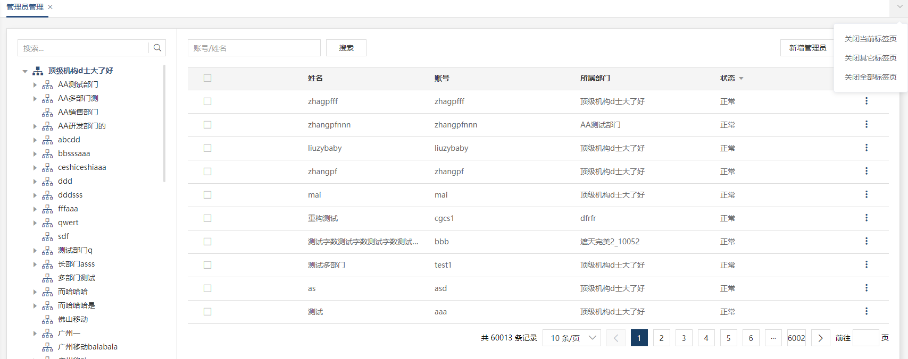

# 首页

微服务系统登录成功后就会进入首页。

## login

管理员必须登录后才可以浏览其它页面，如果没有登录在浏览器上直接输入地址访问是不可以的，因为没有 `token` 无法通过后台身份校验，管理员登录成功后后台会把 token 返回给前端，前端将 token 值存在 localStorage，如果访问一个不存在的页面，页面会重定向到一个 `404` 的页面。

## home

首页分为三个部分，顶部、左侧导航栏和主体内容。

#### 顶部

顶部主要内容包括 logo 和管理员账号，并有修改密码和退出功能，退出当前登录必须调用退出接口，目的是为了清空后台 redis 中存取的 token。

#### 导航栏

左侧导航菜单分为固定的首页和后台返回的多级菜单，目前菜单只支持到三级菜单，实现方式是使用 `element` 的 `el-menu` 插件。菜单的数据是在菜单管理模块中去填写，详细在菜单管理模块中去介绍，代码路径 views/admin/index。

#### 主体内容

点击左侧菜单进行路由的跳转显示相关的页面内容，内容中还含有标签页，每个标签页加了 keepalive 做了缓存，关闭标签的话页面内容不再缓存，如：

